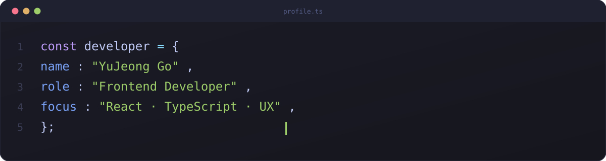

 

 

### About

- 사용자가 실제로 느끼는 경험을 세심하게 다듬는 프론트엔드 개발자입니다
- 백엔드 구조를 이해한 상태에서 협업하기 위해 Spring Boot, Node.js도 함께 공부하고 있어요
- Jira · GitHub Projects로 이슈를 관리하며 팀 단위 개발 흐름에 익숙합니다
- 개발하며 정리한 내용은 velog에 기록합니다

 

### Stack

**Frontend**
 

 

**Backend** · 협업 가능한 수준
 

 

**Collaboration**
 

  

### Contact

